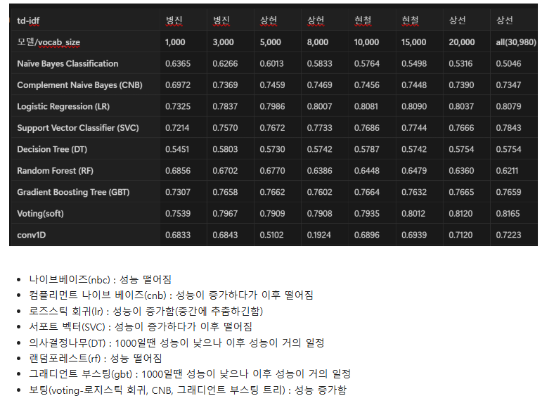
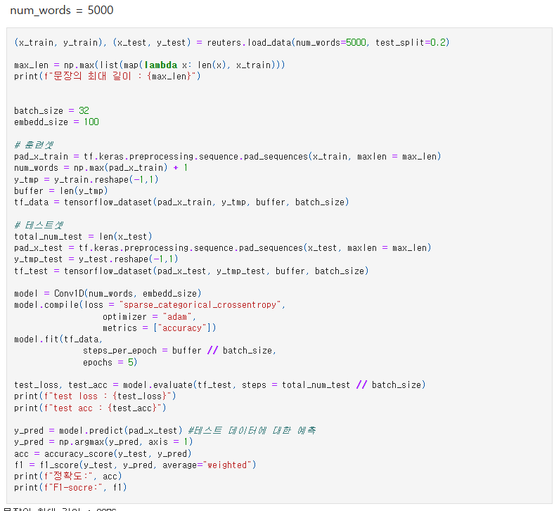
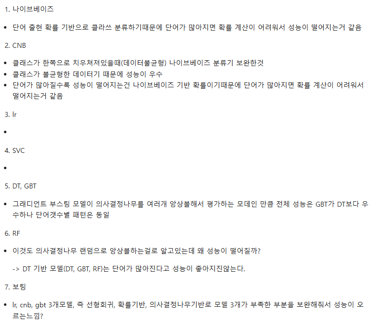
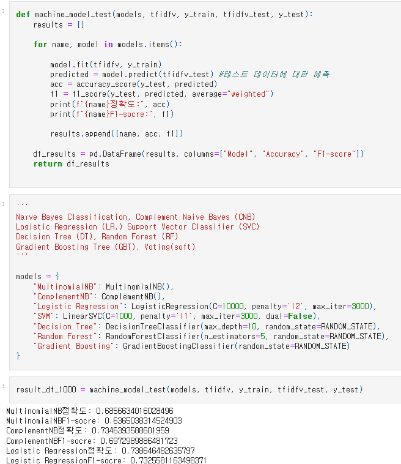

# AIFFEL Campus Online Code Peer Review Templete
- 코더 : 손병진
- 리뷰어 : 염철헌


# PRT(Peer Review Template)
- [X]  **1. 주어진 문제를 해결하는 완성된 코드가 제출되었나요?**
    - 문제에서 요구하는 최종 결과물이 첨부되었는지 확인
        - 중요! 해당 조건을 만족하는 부분을 캡쳐해 근거로 첨부
        - 각 모델과 단어 사전 크기에 대해서 grid search 한 것을 표로 정리하여 알기쉽게 시각화함
        - 
    
- [X]  **2. 전체 코드에서 가장 핵심적이거나 가장 복잡하고 이해하기 어려운 부분에 작성된 
주석 또는 doc string을 보고 해당 코드가 잘 이해되었나요?**
    - 해당 코드 블럭을 왜 핵심적이라고 생각하는지 확인
    - 해당 코드 블럭에 doc string/annotation이 달려 있는지 확인
    - 해당 코드의 기능, 존재 이유, 작동 원리 등을 기술했는지 확인
    - 주석을 보고 코드 이해가 잘 되었는지 확인
        - 중요! 잘 작성되었다고 생각되는 부분을 캡쳐해 근거로 첨부
        - 코드 자체는 핵심적인 부분이 잘 짜여있고 이해하기 쉽도록 범용적인 스타일로 작성하였지만, 주석이나 doc string 등은 부족하여 익숙치 않은 사용자가 활용하기에는 어려울 것으로 예상
        - 
        
- []  **3. 에러가 난 부분을 디버깅하여 문제를 해결한 기록을 남겼거나
새로운 시도 또는 추가 실험을 수행해봤나요?**
    - 문제 원인 및 해결 과정을 잘 기록하였는지 확인
    - 프로젝트 평가 기준에 더해 추가적으로 수행한 나만의 시도, 
    실험이 기록되어 있는지 확인
        - 중요! 잘 작성되었다고 생각되는 부분을 캡쳐해 근거로 첨부
        - 각 머신러닝 기록에 대하여 실험결과를 분석했고, 이후에 딥러닝을 통해서 고전적인 머신러닝 기법의 비교를 수행함
        - 
        
- [X]  **4. 회고를 잘 작성했나요?**
    - 주어진 문제를 해결하는 완성된 코드 내지 프로젝트 결과물에 대해
    배운점과 아쉬운점, 느낀점 등이 기록되어 있는지 확인
    - 전체 코드 실행 플로우를 그래프로 그려서 이해를 돕고 있는지 확인
        - 중요! 잘 작성되었다고 생각되는 부분을 캡쳐해 근거로 첨부
        - 1, 3번과 더불어, 각 모델의 예측 성능에 대해 짧게라도 코멘트를 작성해 전체적인 양상을 정리함
        - 
        
- [X]  **5. 코드가 간결하고 효율적인가요?**
    - 파이썬 스타일 가이드 (PEP8) 를 준수하였는지 확인
    - 코드 중복을 최소화하고 범용적으로 사용할 수 있도록 함수화/모듈화했는지 확인
        - 중요! 잘 작성되었다고 생각되는 부분을 캡쳐해 근거로 첨부
        - 머신러닝 태스크에 대한 grid search를 함수화하여 한 번에 수행하였음.
        - 


# 회고(참고 링크 및 코드 개선)
```
# 지난 번 DLThon에서 같이 프로젝트를 수행한 팀원을 다시 만났는데, 이번 기회로 모듈화를 통해서 훨씬 구조를 간단히 만드신 점에 대해 인상깊었고, 특히 팀원이 서로 분업하여 태스크를 나눠서 수행하고 취합한 것은 아주 좋은 방향 같았습니다.
# 코드 리뷰 시 참고한 링크가 있다면 링크와 간략한 설명을 첨부합니다.
# 코드 리뷰를 통해 개선한 코드가 있다면 코드와 간략한 설명을 첨부합니다.
```
