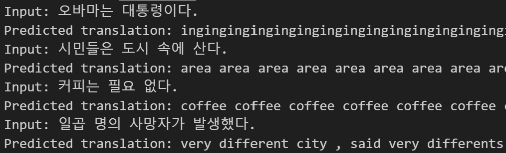
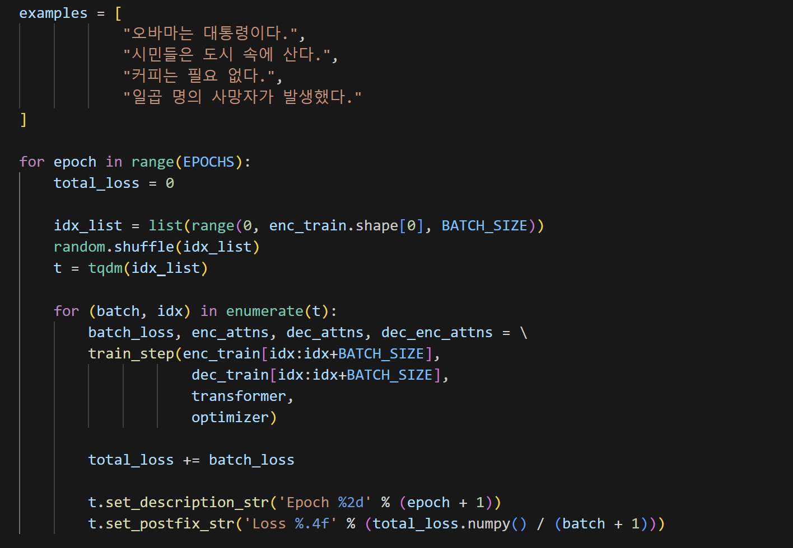
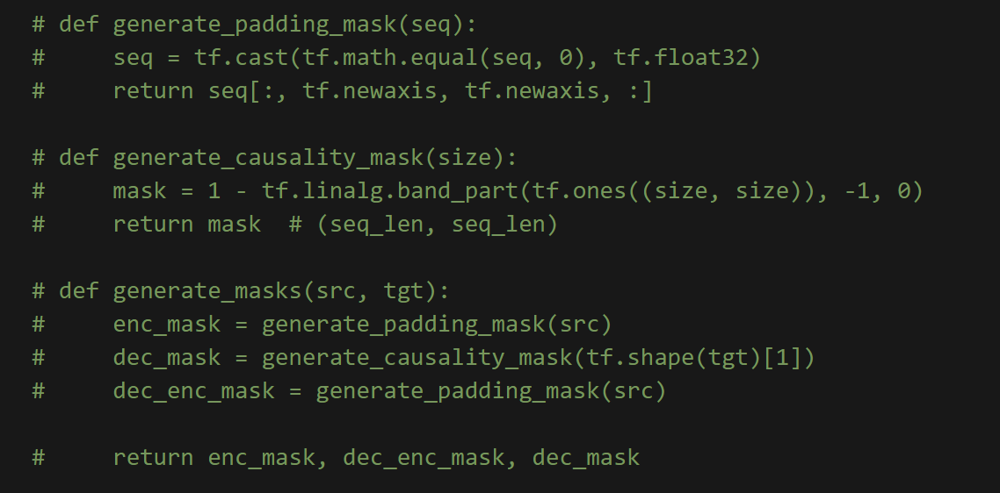
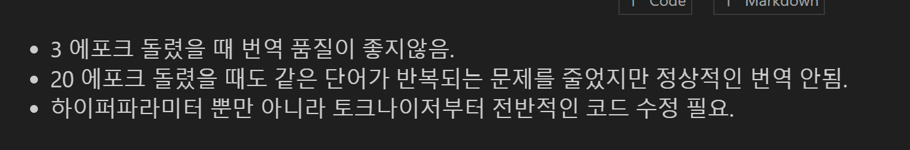
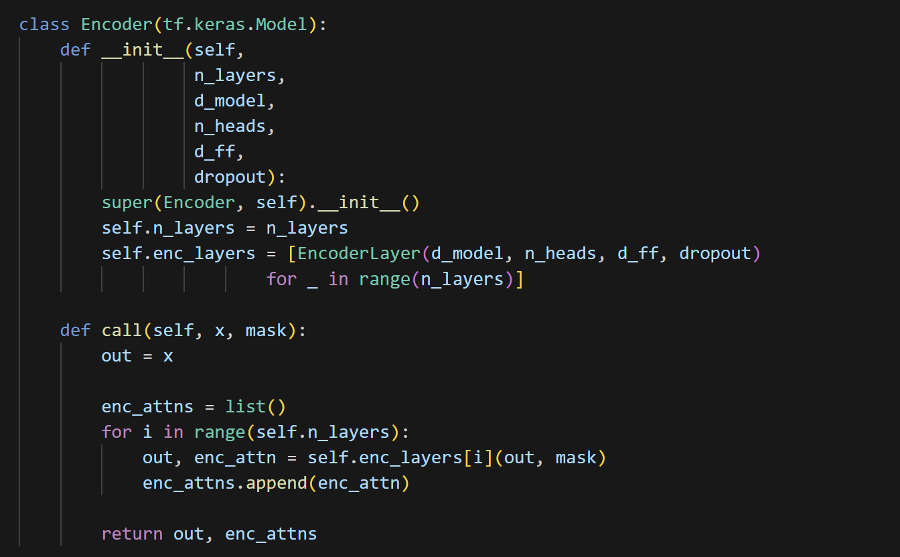

# AIFFEL Campus Online Code Peer Review Templete
- 코더 : 손병진
- 리뷰어 : 손병진


# PRT(Peer Review Template)
- [x]  **1. 주어진 문제를 해결하는 완성된 코드가 제출되었나요?**
    - 프로젝트 목표에 맞게 텍스트 전처리와 토큰화, 임베딩, 학습을 거쳐 번역출력.
    
    
- [x]  **2. 전체 코드에서 가장 핵심적이거나 가장 복잡하고 이해하기 어려운 부분에 작성된 
주석 또는 doc string을 보고 해당 코드가 잘 이해되었나요?**
    - 모델 학습 후 결과 출력되도록 코드 작성.
    
        
- [x]  **3. 에러가 난 부분을 디버깅하여 문제를 해결한 기록을 남겼거나
새로운 시도 또는 추가 실험을 수행해봤나요?**
    - 에러 디버깅을 위해 원본 코드를 두고 수정하여 사용.
    
        
- [x]  **4. 회고를 잘 작성했나요?**
    - 프로젝트 결과와 아쉬운 점 정리.
    
        
- [x]  **5. 코드가 간결하고 효율적인가요?**
    - 코드 구현 모델을 적절히 사용
    


# 회고(참고 링크 및 코드 개선)
```
# 리뷰어의 회고를 작성합니다.
# 코드 리뷰 시 참고한 링크가 있다면 링크와 간략한 설명을 첨부합니다.
# 코드 리뷰를 통해 개선한 코드가 있다면 코드와 간략한 설명을 첨부합니다.
```
